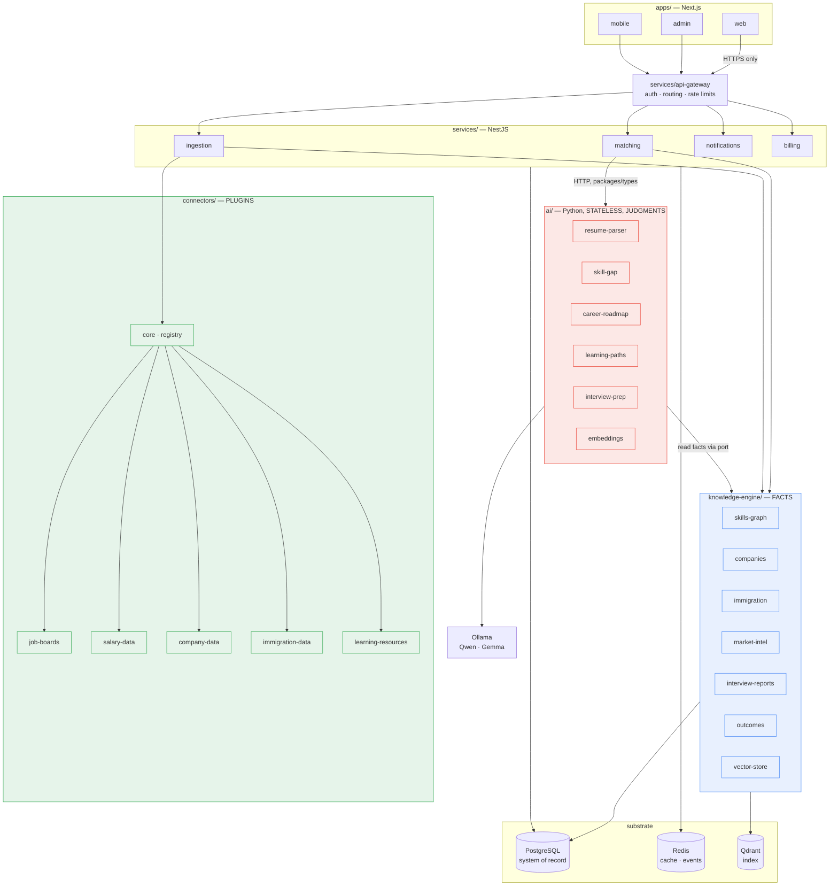
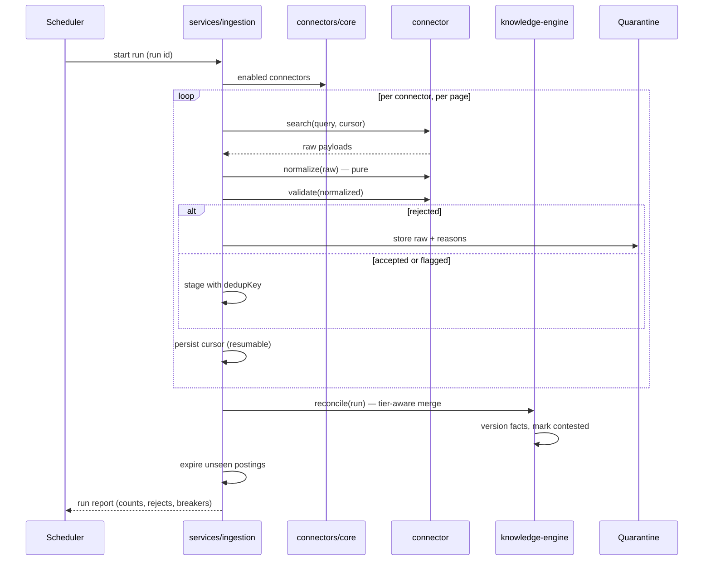
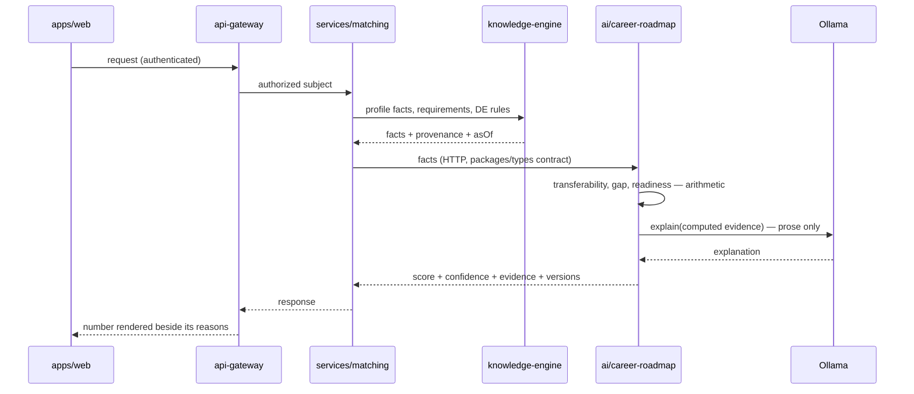
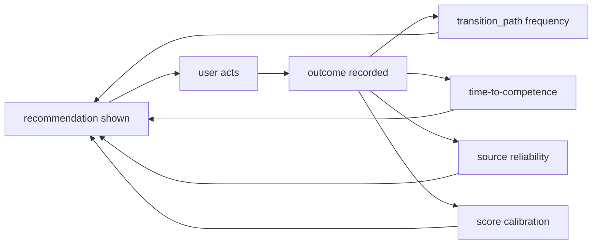

# System Diagram

> **Purpose:** Component and data-flow diagram: ingestion, knowledge, AI, app.

Diagrams only. The reasoning behind the boundaries is in `overview.md` and `principles.md`; the
stage-by-stage narrative is in `data-flow.md`.

## Components and dependency direction

**Read the arrows as "may import / may call".** They point inward only: `apps` → `services` →
`knowledge-engine` → `packages/types`. `ai/` and `knowledge-engine/` must run with `services/` and
`apps/` deleted. Only `connectors/core` may reference a connector. Only `ai/` reaches Ollama. All four
are enforced by `eslint.config.mjs` and `ruff.toml` (ADR-0005), not by convention.

## Ingestion flow

## Reading flow — "am I ready for cloud engineering in Germany?"

The model writes the explanation from evidence that code already computed. It never produces the
number — that is what makes the answer reproducible from `scorerVersion` and `knowledgeAsOf`.

## The learning loop

## Related

- `overview.md`, `principles.md`, `data-flow.md`
- `knowledge-engine.md`, `ai-services.md`, `connectors.md`
- ADR-0001, ADR-0002, ADR-0003, ADR-0004, ADR-0005
