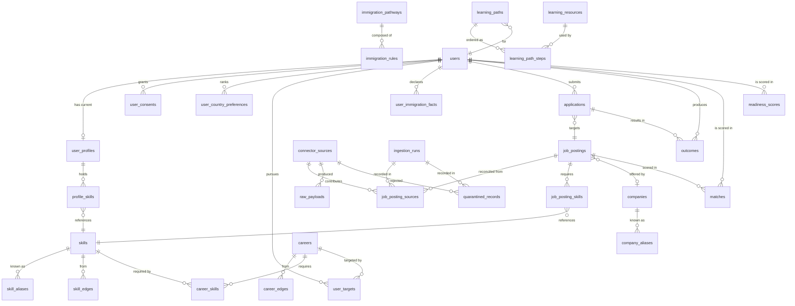

# Relationships

> **Purpose:** ER description across entities.

Cardinalities and delete policies across the schema. The entity documents under `entities/` carry the
column detail; this document is about how they connect and what happens when something is removed.

## ER diagram



## Cardinalities

| From | To | Cardinality | Notes |
|---|---|---|---|
| `users` | `user_profiles` | 1:N, one `is_current` | versions retained so a past score stays explicable |
| `user_profiles` | `profile_skills` | 1:N | replaced wholesale on re-parse |
| `profile_skills` | `skills` | N:1 | resolved via `skill_aliases`, never by name equality |
| `job_postings` | `job_posting_sources` | 1:N | one posting, many sources — this is cross-source reconciliation |
| `job_postings` | `companies` | N:1, nullable | null until resolution; `company_name_raw` always kept |
| `job_postings` | `job_posting_skills` | 1:N | requirements with weights |
| `skills` | `skill_edges` | N:M self-referential | typed, one row per (from, to, type) |
| `careers` | `career_edges` | N:M self-referential | includes `transition_path` with observed frequency |
| `careers` | `career_skills` | N:M with `skills` | plus optional `market_scope` |
| `immigration_pathways` | `immigration_rules` | 1:N, versioned | rule chains via `supersedes` |
| `users` × `job_postings` | `matches` | N:M, one live row per pair | derived |
| `users` × `careers` | `readiness_scores`, `skill_gaps`, `learning_paths` | N:M | derived |
| `applications` | `outcomes` | 1:N | an application produces several outcome events over time |

## Delete policy

The default is `ON DELETE RESTRICT`, everywhere, deliberately. Cascades destroy history quietly, and
almost everything here is either evidence or a fact someone planned against.

| Relationship | Policy | Why |
|---|---|---|
| `matches` → `users`, `job_postings` | `RESTRICT` | erasure is an explicit ordered process, not a side effect of a delete |
| `job_posting_sources` → `job_postings` | `RESTRICT` | provenance must not vanish before the fact it supports |
| `profile_skills` → `user_profiles` | **`CASCADE`** | the only cascade: a profile version's skills have no meaning without the version, and re-parsing replaces them wholesale |
| `skill_edges` → `skills` | `RESTRICT` | deleting a skill referenced by the graph is a data-modeling error to surface, not to absorb |
| `job_posting_skills` → `skills` | `RESTRICT` | same |
| `immigration_rules` → `immigration_pathways` | `RESTRICT` | rule history outlives a pathway's current shape |
| `outcomes` → `users` | `RESTRICT` | erasure detaches the person and retains the anonymized contribution |
| everything person-scoped | `RESTRICT` | erasure runs in the order documented in `entities/user.md` |

**Soft delete first.** `deleted_at` is the normal removal path; hard deletes are reserved for erasure
requests and expired ephemera. Unique indexes are therefore partial — `WHERE deleted_at IS NULL` —
so a soft-deleted row does not block a new one.

## The self-referential graphs

Both graphs are edge tables rather than adjacency columns, because edges carry data of their own —
weight, basis, support, provenance.

```text
skills ──┐                         careers ──┐
         ├── skill_edges ──┐                 ├── career_edges ──┐
         │   from_skill_id │                 │   from_career_id │
         └── to_skill_id ──┘                 └── to_career_id ──┘

  constraints on both: no self-edge, one row per (from, to, type)
```

Directionality per type matters and is not symmetric by default:

- `requires`, `transfers_to`, `subsumes`, `tooling_of` — **directed**. One row.
- `adjacent_to` — **symmetric**. Two rows, written together, so a traversal in either direction is a
  plain index lookup rather than a `UNION`.

## Bridge tables and their extra columns

Every N:M here is a real entity, not a join stub, because each carries meaning:

| Bridge | Extra columns | Why it is not a plain join |
|---|---|---|
| `job_posting_skills` | `weight`, `basis`, `is_required`, `source_span` | a requirement has a strength and an origin |
| `career_skills` | `weight`, `cluster`, `basis`, `support`, `market_scope` | requirements differ by market |
| `profile_skills` | `status`, `evidence_kind`, `source_span`, `confidence` | evidenced and claimed are different facts |
| `job_posting_sources` | tier, URL, `retrieved_at`, `connector_version`, `run_id` | this *is* the provenance record |
| `learning_path_steps` | `position`, `gap_item_id`, `estimated_effort`, `verification` | order is the product |

## Cross-class references

Derived rows point at both world facts and person data:

```text
matches ──► users (person)          readiness_scores ──► users (person)
        └─► job_postings (world)                     └─► careers (world)
```

This is the one place the three data classes touch, and it is why erasure must delete derived rows
before detaching person rows — the reverse order leaves a match referencing a cleared subject.

## Referential rules

- Every reference is a declared foreign key with an explicit `ON DELETE`. Relying on the default by
  omission is not a decision.
- No cross-service foreign key into a table another service owns. Services communicate over HTTP or
  events (`docs/architecture/overview.md`).
- No polymorphic reference (`entity_type` + `entity_id`) — it cannot be constrained, so it always
  eventually points at nothing.
- Source identifiers (`connector_sources.id`, `skills.slug`) are permanent. They are referenced by
  data and by prompts.

## Related

- `schema-overview.md` — the entity map and the three data classes
- `entities/*` — column-level detail
- `migrations.md` — how a relationship is changed safely
- `data-retention.md` — what the delete policies above are protecting
- `.claude/skills/database/SKILL.md`
